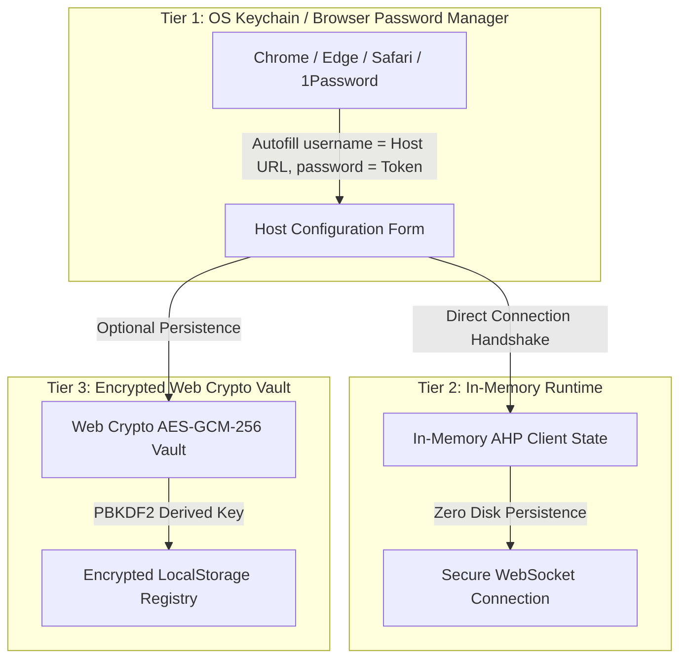

# Specification: Agent Host Protocol Client-Side UI

**Status:** Proposed  
**Document Version:** 1.0.0  
**Target Package:** `agent-host-protocol-ui`  
**Reference Protocol:** Agent Host Protocol (AHP) v0.9.x / v1.x (`@microsoft/agent-host-protocol`)  
**Inspiration:** VS Code Agents View (`chat.remoteAgentHostsEnabled`, "Agents" window)

---

## 1. Overview & Objectives

### 1.1 Goal
Provide a rich, responsive, fully client-side web application running in a standard modern browser to connect to, inspect, and drive AI agent sessions hosted by any server implementing the **Agent Host Protocol (AHP)** (such as [`pi-agent-host-protocol`](https://github.com/toumorokoshi/pi-agent-host-protocol)).

### 1.2 Design Philosophy
- **Client-Side Only:** No intermediary application backend required. The browser connects directly to the AHP host over WebSockets (`ws://` or `wss://`), utilizing the browser runtime capabilities of `@microsoft/agent-host-protocol/client` and `@microsoft/agent-host-protocol/ws`.
- **VS Code Agents View Fidelity:** Emulate and enhance the user experience of VS Code's native Agents window—supporting session catalogs, streaming responses, reasoning steps, tool call inspections with approval flows, steering, message queueing, resumable errors, and interactive terminals.
- **Modern, Premium Aesthetics:** Dark-mode first design adhering to modern IDE visual standards with clean typography, micro-interactions, distinct state indicators, and syntax-highlighted code and tool call views.
- **Protocol Completeness:** Full support for core channels: `ahp-root://`, `ahp-session:/{id}`, `ahp-chat:/{id}`, and `ahp-terminal:/{id}`.

---

## 2. Feature Analysis & Inspiration from VS Code Agents View

The VS Code Agents View represents Microsoft's architecture for decoupling agent execution hosts from agent user interfaces. A comprehensive study of the VS Code Agents view reveals the following key capabilities that this UI must support:

### 2.1 Host Connection & Multi-Host Management
- **Connection Configuration:** Users can add multiple remote agent hosts via WebSocket URL (including authentication tokens, e.g. `ws://127.0.0.1:63877?tkn=...`).
- **Browser Password Manager Integration:** Supports saving the WebSocket Host URL as a Username and the authentication token as a Password in Chrome Password Manager, Apple Keychain, and W3C `navigator.credentials` for seamless 1-click autofill and biometric login.
- **Connection Lifecycle & Status:** Real-time visual status badge (Connecting, Connected, Disconnected, Reconnecting, Protocol Handshake Error).
- **Protocol Negotiation:** Handles protocol version negotiation (0.9.x through 1.x) during `initialize`.
- **State Reconnect & Replay:** Automatic reconnection using `reconnect` RPC with action sequence replay or state snapshot recovery (`AhpStateMirror`).

### 2.2 Session Management & Catalog
- **Session List Sidebar:**
  - Categorization into **Live / Active Sessions** (sessions actively running in a process or interactive terminal) and **Past / Disk Sessions**.
  - Real-time updates via `root/sessionAdded`, `root/sessionRemoved`, and `session/chatUpdated`.
  - Session metadata display: Title, working directory, last modified timestamp, and active status badge.
  - Search and filter by session title, working directory, and active status.
- **Session Operations:**
  - **Create Session:** Modal dialog allowing directory selection, agent provider selection, initial model selection, and dynamic config parameters (`resolveSessionConfig`).
  - **Rename Session:** Inline or action-triggered title update (`session/titleChanged`), syncing with the agent host.
  - **Archive / Unarchive:** Mark sessions as archived (`session/isArchivedChanged`).
  - **Dispose Session:** Clean up empty/scratch sessions (`disposeSession`).

### 2.3 Conversational Timeline & Turns
- **Turn-based Architecture:** Every interaction is structured as a `Turn` containing an initiating `Message` and an array of `ResponsePart` objects.
- **User Turn Display:**
  - User prompt text with markdown rendering.
  - Selected model and thinking configuration badge.
  - Attached resources (files, selections, symbols).
- **Assistant Streaming & Response Parts:**
  - **Markdown Text:** Streaming text token rendering with syntax highlighting, copy blocks, and line numbering.
  - **Reasoning / Thinking Parts:** Dedicated collapsible accordion displaying model chain-of-thought, live elapsed duration timer, and token consumption.
  - **Tool Calls:**
    - Tool identifier, call ID, and formatted parameter payload.
    - Lifecycle status: `streaming`, `pending-confirmation`, `running`, `completed`, `cancelled`, `auth-required`.
    - **Interactive Tool Approvals:** When a tool call requires user consent (`pending-confirmation`), present Accept / Reject / Always Allow options, dispatching `chat/toolCallConfirmed`.
    - Tool results display: plain text output, structured data, file diffs (`FileEdit`), or terminal output links.
  - **Input Requests / Elicitations (`ChatInputRequest`):**
    - Forms presented inside the stream for agent-requested user input (Text, Number, Boolean, Single-Select, Multi-Select).
    - Syncing draft answers via `chat/inputAnswerChanged` and submitting via `chat/inputCompleted`.
  - **System Notifications:** Informational events (e.g. background task completion, subagent notifications) styled distinctively from model messages.
  - **Resumable Errors:** Mid-turn failures (e.g., model provider timeouts or malformed tool arguments) render an actionable error banner with a "Resume Turn" button (`chat/turnResume`).
  - **Turn Metrics:** Token usage (prompt tokens, completion tokens, cached tokens) and execution duration.

### 2.4 Prompt Composer & Execution Controls
- **Smart Textarea:** Autosizing input with multiline support (`Shift+Enter` for newline, `Enter` to send).
- **Slash Commands Autocomplete (`/`):** Triggered on typing `/` at the start of input; invokes the `completions` RPC on the host to list available skills, prompt templates, and commands (e.g., `/ahp`, `/commit`, `/review`).
- **In-flight Turn Controls:**
  - **Abort / Stop:** Immediate turn cancellation (`chat/turnCancelled`) with matched active `turnId`, elapsed duration, and immediate optimistic state resolution displayed prominently while a turn is active.
  - **Steering Messages:** Ability to submit guidance *while* a turn is running (`chat/pendingMessageSet` with `kind: steering`) to steer the model without aborting.
  - **Queued Messages:** Ability to queue follow-up prompts (`kind: queued`) that execute sequentially once the active turn completes.
  - **Queue Drawer / Manager:** Visual list of queued messages with drag-to-reorder (`chat/queuedMessagesReordered`) and delete capabilities (`chat/pendingMessageRemoved`).
- **Draft Privacy & Optional Synchronization:** In-progress composition is strictly private to the local browser session by default. Keystrokes are buffered locally without sending uncommitted text over the wire. Syncing to the host via `chat/draftChanged` is strictly opt-in for users requiring multi-device draft continuity.

### 2.5 Integrated Tooling & Auxiliary Views
- **Interactive Terminals:** Full terminal emulator (xterm.js) embedded in a slide-over or tab panel, communicating with `ahp-terminal:` channels via `createTerminal` / `disposeTerminal` and bidirectional stream dispatch.
- **Skills & Customizations Browser:** Inspector panel listing all skills, MCP servers, and prompt templates advertised by the agent host on `RootState` and `SessionState`.
- **Changeset & Diff Viewer:** Visual review of modified files and unified diffs generated during turns.

---

## 3. Architecture & Data Flow

```
┌────────────────────────────────────────────────────────────────────────┐
│                        Browser (Client-Side)                           │
│                                                                        │
│  ┌──────────────────────────────────────────────────────────────────┐  │
│  │                    UI View Layer (Vite + React)                  │  │
│  │  ┌──────────────┐ ┌──────────────┐ ┌──────────────────────────┐  │  │
│  │  │ Host Selector│ │ Session List │ │ Chat Timeline & Composer │  │  │
│  │  └──────┬───────┘ └──────┬───────┘ └────────────┬─────────────┘  │  │
│  └─────────┼────────────────┼──────────────────────┼────────────────┘  │
│            ▼                ▼                      ▼                   │
│  ┌──────────────────────────────────────────────────────────────────┐  │
│  │                     App Store / State Mirror                     │  │
│  │    • MultiHostClient / AhpClient                                 │  │
│  │    • AhpStateMirror (RootState, SessionState, ChatState)         │  │
│  │    • LocalStorage Settings (Host URLs, tokens, active host)      │  │
│  └──────────────────────────────────┬───────────────────────────────┘  │
│                                     ▼                                  │
│  ┌──────────────────────────────────────────────────────────────────┐  │
│  │       @microsoft/agent-host-protocol Client & WebSocket          │  │
│  │    • WebSocketTransport                                          │  │
│  │    • JSON-RPC 2.0 Framing & Protocol Negotiation                 │  │
│  │    • Subscription Manager (ahp-root://, ahp-session:, ahp-chat:) │  │
│  └──────────────────────────────────┬───────────────────────────────┘  │
└─────────────────────────────────────┼──────────────────────────────────┘
                                      │ WebSocket (JSON-RPC 2.0)
                                      ▼
             ┌─────────────────────────────────────────────────┐
             │            Agent Host Protocol Server           │
             │   (e.g., pi-agent-host-protocol / ws listener)  │
             └─────────────────────────────────────────────────┘
```

### 3.1 Direct Browser WebSocket Transport
The browser establishes direct WebSocket connections:
```ts
import { WebSocketTransport } from '@microsoft/agent-host-protocol/ws';
import { AhpClient, AhpStateMirror } from '@microsoft/agent-host-protocol/client';

const transport = await WebSocketTransport.connect(hostUrl);
const client = new AhpClient(transport);
client.connect();

const initResult = await client.initialize({
  clientId: 'ahp-web-ui-' + randomUUID().slice(0, 8),
  protocolVersions: ['1.0.0', '0.9.0'],
  initialSubscriptions: ['ahp-root://'],
});
```

#### Dynamic Host Resolution for LAN & Network Access
When the client UI is accessed from a remote device over a LAN address or domain (e.g. `http://192.168.1.50:5173`), hardcoding `127.0.0.1` as the default WebSocket target results in connection failure because loopback resolves on the client device itself. The UI dynamically detects non-localhost origins via `getDefaultHost(window.location)` and targets the workstation's host address (e.g. `ws://192.168.1.50:63877`), providing contextual diagnostics if loopback is targeted or if the AHP server must be configured with `--host 0.0.0.0`.

### 3.2 State Synchronization & Mirroring
The UI leverages `AhpStateMirror` to maintain an authoritative, reactive local replica of the host state:
1. `ahp-root://`: Provides `agents`, `terminals`, `activeSessions`, `config`.
2. `ahp-session:/{sessionId}`: Provides session properties, `chats`, `workingDirectories`, `customizations` (skills, prompt templates).
3. `ahp-chat:/{chatId}`: Provides conversation history (`turns`), current in-flight turn (`activeTurn`), `steeringMessage`, `queuedMessages`, and `draft`.
4. `ahp-terminal:/{terminalId}`: Provides terminal metadata and stream data.

### 3.3 Storage & Persistence Architecture
- **Encrypted Host Registry:** Stored in `localStorage` or `IndexedDB`, encrypted at rest using AES-GCM-256 via the Web Crypto API. Stores Host Name, WebSocket URL, and authentication tokens (`tkn=...`).
- **Encrypted Local Cache:** Cached session metadata, recent turns, and uncommitted drafts are encrypted with the active AES-256 key.
- **Privacy & Storage Modes:**
  - *Ephemeral (Zero-Knowledge) Mode:* AES key generated in memory (`crypto.getRandomValues`), held only for the browser session. Closing the tab purges the key.
  - *Passphrase Vault Mode:* AES key derived via PBKDF2 (SHA-256, 600,000 iterations) from a user master password.
  - *Memory-Only Mode:* Zero writes to disk/localStorage; all state is ephemeral in JavaScript heap memory.

---

## 4. UI Layout & Component Specifications

The layout conforms to a modern three-column / docked IDE aesthetic:

```
+-----------------------------------------------------------------------------------------+
| [Header] Logo | [Theme Toggle] [Demo/Live] [⚙ Settings (● host status)]  [+ New Session] |
+------------------+----------------------------------------------------+------------------+
| SESSIONS         | CHAT: "Refactor database migrations"               | DETAILS / TOOLS  |
| ---------------- | -------------------------------------------------- | ---------------- |
| [Search sessions]| Working Dir: /workspace/project                    | [Skills (4)]     |
|                  | Model: anthropic/claude-3-7-sonnet (High Thinking) | [Terminals (1)]  |
| > Live (2)       | -------------------------------------------------- | [Changes (2)]    |
|   • Migration... | [User Turn]                                        |                  |
|     (Active)     |   "Fix the schema migration script"                | Interactive pty  |
|   • TUI Session  |                                                    | terminal output  |
|                  | [Assistant Turn]                                   | or diff preview  |
| v Past (14)      |   v Thinking (4.2s)                                |                  |
|   • Add tests    |   Tool: run_command `npm test` [Success]           |                  |
|   • Lint fixes   |   I have resolved the schema migration issue...    |                  |
|                  | -------------------------------------------------- |                  |
|                  | [Prompt Input: Type your message or / for skills]  |                  |
|                  | [● Steering] [Queue] [Model Picker]      [Send / ■]|                  |
+------------------+----------------------------------------------------+------------------+
```

### 4.1 Header Bar
- **Brand Title & Logo:** Agent Host Protocol UI (`AHP UI`).
- **Settings (Cog) Icon:**
  - Opens the "Configure Agent Host" popup modal (Name, WebSocket URL with token parameter).
  - Overlaid status dot indicates connection state (`green` = connected, `amber` = connecting/reconnecting, `red` = disconnected).
  - Placed in the right-hand action cluster so the host configuration stays reachable on narrow mobile viewports (the previous inline host pill was squeezed underneath the theme toggles on mobile).
- **Global Actions:**
  - "New Session" button.
  - Connection retry button when disconnected.
  - Theme toggle (Auto / Light / Dark, using dark mode by default, but automatically honoring the system provided color scheme when available).

### 4.2 Sidebar: Sessions Explorer
- **Search & Filter:** Instant text filtering over titles, session IDs, and working directory paths.
- **Section 1: Active / Live Sessions:**
  - Live TUI sessions bridged from terminal `pi` processes or currently active RPC sessions.
  - Pulsing indicator for actively generating turns.
- **Section 2: Saved / Recent Sessions:**
  - Paginated list populated via `listSessions`.
  - Display of relative time (e.g., "5m ago", "Yesterday").
- **Session Item Context Menu / Actions:**
  - Rename session (`session/titleChanged`).
  - Archive / Unarchive (`session/isArchivedChanged`).
  - Delete / Dispose (`disposeSession`).

### 4.3 Center Panel: Chat Timeline
- **Session Header Banner:**
  - Editable Session Title.
  - Working directory chip with folder icon.
  - Model & Thinking Level selector dropdown.
  - Active turn status indicator (Idle, Generating, Awaiting Approval, Error).
- **Timeline Items:**
  - **User Message:** Clean bubble with user avatar, timestamp, model badge, and any attached files/ranges.
  - **Thinking / Reasoning Accordion:** Collapsible drawer with discreet purple/indigo styling showing real-time token generation and thinking duration.
  - **Tool Calls:**
    - Tool badge with name (e.g. `run_command`, `read_file`, `write_to_file`).
    - Collapsible JSON parameters view.
    - Status pill (`Streaming`, `Running`, `Success`, `Failed`, `Waiting Approval`).
    - Tool Confirmation Bar (when required): "This tool requires permission to execute" with [Approve] and [Deny] buttons.
    - Result Viewer: Syntax highlighted output, error details, or file change summary.
  - **Input Requests (`ChatInputRequest`):**
    - Rendered interactive questionnaires for agent elicitations.
    - Form fields (text inputs, numbers, checkboxes, single/multi select radio groups).
    - [Submit Answers] and [Skip] action triggers.
  - **Resumable Error Banner:**
    - When a model server fails mid-turn with `resumable: true`, render a yellow/red warning banner with explanation and a "Resume Turn" action button (`chat/turnResume`).

### 4.4 Chat Composer & Control Center
- **Textarea:** Expandable text editor with markdown/code syntax convenience.
- **Completions Popup:**
  - Triggered by `/` at position 0.
  - Shows skills, prompt templates, and host commands fetched via `completions`.
  - Keyboard navigation (`Up`, `Down`, `Enter`, `Escape`).
- **Control Bar:**
  - **Model Selector:** Quick switch for provider/model and reasoning effort.
  - **Steering Toggle / Mode:** Allows sending a steering prompt during an ongoing turn (`chat/pendingMessageSet`).
  - **Queued Messages Counter & Drawer:** Displays badges for queued messages; opens drawer to reorder or cancel queued items.
  - **Action Button:**
    - State A (Idle): "Send" button (`chat/turnStarted`).
    - State B (Streaming): "Stop" button (`chat/turnCancelled`).

### 4.5 Auxiliary Inspector Panel (Tabs)
- **Skills & Customizations Tab:** Inspect active skills loaded for the session, prompt templates, and available tools.
- **Terminals Tab:** Integrated `xterm.js` terminal connected to host ptys (`ahp-terminal:` channels).
- **File Changes Tab:** List of modified files from `ChangesSummary` with click-to-view diffs.

---

## 5. Technology Stack & Tools

1. **Framework:** Vite + React 19 + TypeScript.
2. **Protocol SDK:** `@microsoft/agent-host-protocol` (`^1.0.0`) for types, client, reducers, and WebSocket transport.
3. **Styling:** Vanilla CSS design system adhering to standard Visual Studio Code Dark+ and Light+ palettes, with high-contrast semantic token colors (`#4fc1ff` cyan tool and command names, `#1e1e1e` editor canvas, `#252526` sidebar, `#c586c0` reasoning streams, and `#0e639c` buttons) that exceed WCAG AA/AAA contrast guidelines.
4. **Terminal Emulator:** `@xterm/xterm` + `@xterm/addon-fit` for interactive terminal sessions.
5. **Markdown & Code Rendering:** Lightweight, secure markdown parser with syntax highlighting.
6. **Code Quality & Build:** Biome (`@biomejs/biome`) for formatting and linting; `just` for workflow automation.
7. **Testing:** Node.js test runner (`node:test`) or Vitest for unit testing client state handling and reducers.

---

## 6. User Privacy & Security Architecture

Because user interactions with AI agents often involve proprietary codebases, confidential business logic, security credentials, and sensitive prompts, `agent-host-protocol-ui` enforces strict privacy and security guarantees across data in flight, data at rest, and browser execution boundaries.

### 6.1 User Input Privacy & Confidentiality Guarantees

1. **Air-Gapped Operation (Zero External Telemetry or CDN Exfiltration):**
   - The application has **zero** third-party network dependencies at runtime.
   - No tracking, analytics, crash reporting, telemetry, or remote web fonts (e.g. Google Fonts) are used. All assets (fonts, icons, styles, JavaScript bundles) are strictly self-contained.
   - All network traffic is exclusively point-to-point between the user's browser session and the user-specified Agent Host WebSocket endpoint.

2. **Private Composer Drafting (No Unintentional Broadcasts):**
   - In AHP, `chat/draftChanged` allows clients to sync in-progress draft text. By default, `agent-host-protocol-ui` operates in **Private Drafting Mode**:
     - In-progress keystrokes and uncommitted composer messages remain strictly in the local client's memory.
     - Keystrokes and drafts are never dispatched over WebSocket (`chat/draftChanged`) until and unless the user explicitly enables "Collaborative / Multi-Client Draft Sync" in session settings.
     - When the user presses Send, the message is dispatched as an explicit turn (`chat/turnStarted`).

3. **Client-Side Encryption at Rest (Web Crypto API):**
   - Any sensitive state persisted across browser sessions (host configurations, authentication tokens, cached turn history, or offline drafts) is encrypted before writing to persistent browser storage (`localStorage` or `IndexedDB`).
   - **Encryption Standard:** AES-GCM with a 256-bit key (`SubtleCrypto` in the native Web Crypto API).
   - **Key Derivation & Storage Modes:**
     - **Mode A: Ephemeral / Zero-Knowledge Session (Default):** A cryptographically strong 256-bit key is generated via `crypto.getRandomValues()` and held exclusively in memory (`sessionStorage` or application memory). If the browser tab or window is closed, the key is permanently destroyed, rendering any cached data unreadable.
     - **Mode B: Passphrase-Protected Vault:** The AES-256 key is derived from a user-supplied master passphrase using **PBKDF2-HMAC-SHA-256** (minimum 600,000 iterations and a unique 16-byte cryptographic salt). Data is decrypted on demand when the user enters their passphrase upon loading the UI.
     - **Mode C: Ephemeral-Only (No Disk Writes):** A strict memory-only mode where no conversation history, drafts, or tokens ever touch `localStorage` or `IndexedDB`. All state lives in JavaScript heap memory and is wiped on page unload.

4. **Credential & Token Vault:**
   - Host connection tokens (`ws://host?tkn=...`) and MCP authentication secrets are stripped from URLs before display in the address bar or UI labels.
   - Tokens in memory are stored in a dedicated, isolated credential store that is never serialized into plain-text logs or debug dumps.
   - Tokens sent over WebSockets are kept in the WebSocket handshake query/header or via explicit `authenticate` commands.

### 6.2 Transport Security & Network Isolation

1. **Transport Layer Security (TLS/WSS):**
   - Non-local connections (remote servers, cloud endpoints, LAN hosts) **must** utilize `wss://` (WebSocket Secure).
   - Insecure `ws://` connections are restricted strictly to loopback addresses (`127.0.0.1`, `localhost`, and `[::1]`).
   - If the UI is hosted on an `https://` origin, the browser's native mixed-content policy prevents unencrypted `ws://` connections to remote IPs, protecting against eavesdropping and MITM tampering.

2. **Origin Validation & CSRF/WebSocket Hijacking Protection:**
   - Client sends standard `Origin` headers during WebSocket handshakes.
   - WebSocket connection URLs are validated against strict regex patterns (valid protocol `ws:`/`wss:`, valid hostname/IP, valid port, sanitized parameters) to prevent protocol injection or SSRF-like local port scanning.

### 6.3 Defense-in-Depth Against Cross-Site Scripting (XSS)

Because AI agents and tool outputs process arbitrary code, command output, and markdown, malicious or hallucinated agent output could attempt prompt injection or script injection.

1. **Strict Markdown & HTML Sanitization:**
   - All rendered markdown, code snippets, tool inputs, and tool outputs are passed through an AST-based sanitizer (e.g. `DOMPurify`) with an aggressive allowlist:
     - Disallow `script`, `iframe`, `object`, `embed`, `base`, `form`, and `svg` script elements.
     - Disallow inline event handlers (`onload`, `onerror`, `onclick`, etc.).
     - Disallow dangerous URI schemes (`javascript:`, `data:text/html`, `vbscript:`). Only `http:`, `https:`, `ws:`, `wss:`, and `file:` are permitted on links.
   - Code syntax highlighting is performed via tokenization without raw `innerHTML` evaluation.

2. **Content Security Policy (CSP):**
   - The application enforces a strict Content Security Policy:
     ```http
     default-src 'none';
     script-src 'self';
     style-src 'self' 'unsafe-inline';
     img-src 'self' data: blob:;
     font-src 'self' data:;
     connect-src 'self' ws: wss:;
     frame-ancestors 'none';
     form-action 'none';
     base-uri 'none';
     ```
   - This ensures that even in the unlikely event of an injection vulnerability, exfiltration of user prompts, tokens, or encryption keys to third-party endpoints is blocked at the browser network layer.

### 6.4 Sensitive Input Masking & Tool Execution Guardrails

1. **Sensitive Field Masking in Input Requests (`ChatInputRequest`):**
   - For agent elicitations asking for secrets, tokens, or passwords, input fields support a `masked: true` or password-type representation to prevent shoulder-surfing and accidental screen-share disclosure.

2. **Explicit Tool Confirmation UI:**
   - Tool calls marked with `ToolCallStatus.PendingConfirmation` require explicit user consent before execution.
   - The UI clearly displays the tool name, target command/file, and full parameter payloads so the user can audit destructive operations (e.g., `rm`, file overwrites, git pushes) before authorizing.

3. **Memory Zeroing & Session Purge:**
   - When a user chooses "Disconnect Host" or "Clear Session", the UI clears active subscription channels, purges the in-memory state mirror, and overwrites encryption keys in memory.

### 6.5 Browser Password Manager & Credential Management API Integration

#### 6.5.1 Motivation & Rationale
When connecting to local or remote AHP daemons (such as `pi-agent-host-protocol`), hosts generate ephemeral authentication tokens for authorization (e.g., `ws://127.0.0.1:63877?tkn=abc123xyz`). Local ports and tokens frequently rotate across restarts and sessions.

Modern browser engines (Google Chrome, Microsoft Edge, Safari, Firefox) and system password managers (Apple Keychain, Windows Credential Manager, 1Password, Bitwarden) use intelligent form heuristics to detect login workflows. When presented with a connection endpoint and an authentication token, these tools naturally attempt to save them as:
- **Username / Account ID:** The WebSocket Host Endpoint (e.g., `ws://127.0.0.1:63877` or `wss://agent.internal:8443`).
- **Password / Credential:** The Host Authentication Token (`tkn=...`).

Rather than treating this as an unexpected quirk, this specification formalizes and elevates browser password manager support as a first-class, secure credential persistence mechanism.

#### 6.5.2 Security Benefits of Browser Password Manager Storage
1. **OS-Level Hardware Keychain:** Browsers and password managers store credentials in OS-native hardware security modules (Apple Keychain via Secure Enclave, Windows Hello via TPM/DPAPI, Linux Secret Service).
2. **Biometric Protection:** Accessing autofill credentials requires biometric verification (Touch ID, Face ID, Windows Hello) or master vault unlocking.
3. **Cross-Device & Profile Sync:** Users logged into Chrome or Keychain can synchronize their remote agent hosts seamlessly across workstations.
4. **Elimination of Plaintext Scratchpads:** Eliminates the risky developer habit of pasting connection tokens into plaintext shell histories, text files, or chat windows.
5. **Origin Isolation:** Web origin boundaries ensure that credentials saved for `agent-host-protocol-ui` are isolated to the UI's origin (e.g. `http://localhost:5173` or `https://agents.internal`) and cannot be accessed by external sites.

#### 6.5.3 Semantic Form Architecture & DOM Heuristics
To ensure universal compatibility across Chrome, Safari, Firefox, and third-party password manager extensions (1Password, Bitwarden, LastPass), the Host Configuration dialog adheres to standard web credential form guidelines:

1. **Explicit `<form>` Container:**
   - The connection modal encloses inputs in a standard `<form>` tag with `method="post"` and `action="javascript:void(0);"`.
   - An explicit `<button type="submit">` triggers the DOM submit event, which password managers monitor to prompt the "Save Password / Update Password" infobar.
2. **Canonical Host Endpoint (`name="username"`, `autocomplete="username"`):**
   - Identifier field tagged with `name="username"`, `id="ahp-host-url"`, `type="text"`, and `autocomplete="username"`.
   - Represents the canonical target WebSocket URL (e.g., `ws://127.0.0.1:63877`).
3. **Authentication Token (`name="password"`, `autocomplete="current-password"`):**
   - Secret credential tagged with `name="password"`, `id="ahp-host-token"`, `type="password"`, and `autocomplete="current-password"`.
   - Masked with an optional reveal/mask toggle button.
4. **Human-Readable Host Name (`name="name"`):**
   - User-defined label (e.g., "Local Pi Agent") to distinguish multiple hosts.

#### 6.5.4 Smart URL Decomposition & Query Parameter Extraction
In practice, agent host daemons output full connection URLs containing query parameters:
```text
ws://127.0.0.1:63877?tkn=9f4a180c4b2e...
```
If a user pastes this full string directly into the Host URL field, naive form handling would treat the entire string (including the token) as the username, causing password managers to save a dirty, unmaintainable entry where the username changes on every token refresh.

**Specification Requirement:**
The UI MUST implement intelligent URL decomposition:
1. When user input in the Host URL field contains query parameters `tkn` or `token` (e.g., `ws://127.0.0.1:63877?tkn=abc123xyz`):
   - The query parameter value (`abc123xyz`) is automatically stripped from the URL and populated into the **Password (Token)** field.
   - The stripped, clean URL (`ws://127.0.0.1:63877`) is populated into the **Username (Host URL)** field.
2. When the user submits, Chrome and password managers receive the clean host endpoint as the username and the extracted token as the password.
3. If the daemon restarts with a new token on the same port, Chrome recognizes the username (`ws://127.0.0.1:63877`) and prompts: *"Update password for ws://127.0.0.1:63877?"*, updating the token in-place without creating duplicate entries.

#### 6.5.5 W3C Credential Management API Integration (`navigator.credentials`)
In supporting modern browsers (Chrome, Edge, Opera), the UI integrates programmatically with the W3C Credential Management API to provide high-fidelity credential storage and retrieval:

1. **Saving Credentials on Successful Connection (`navigator.credentials.store`):**
   - After a WebSocket handshake (`AhpClient.initialize`) succeeds and verifies the token's validity, the application constructs a `PasswordCredential`:
     ```typescript
     if (typeof window !== 'undefined' && 'PasswordCredential' in window && navigator.credentials && host.token) {
       const cred = new PasswordCredential({
         id: host.url,          // Canonical WebSocket endpoint (e.g., "ws://127.0.0.1:63877")
         password: host.token,  // Authentication token
         name: host.name || host.url,
       });
       await navigator.credentials.store(cred);
     }
     ```
   - Only successfully authenticated credentials are submitted to the credential store, preventing stale or invalid tokens from polluting the user's password vault.

2. **Proactive Credential Retrieval (`navigator.credentials.get`):**
   - When the Host Modal opens or when the application launches without an active session, the UI queries `navigator.credentials.get({ password: true, mediation: 'optional' })`.
   - If a saved `PasswordCredential` is returned, the dialog pre-fills the WebSocket URL and token, or displays a quick "Connect as [Host URL]" one-click button.

3. **Preventing Silent Auto-Access (`navigator.credentials.preventSilentAccess`):**
   - When the user explicitly disconnects a host or chooses "Forget Host Credentials", the application invokes `navigator.credentials.preventSilentAccess()`. This ensures the browser will not silently auto-fill and auto-connect without explicit user interaction in future sessions.

#### 6.5.6 Multi-Tier Credential & Privacy Architecture
The password manager integration forms Tier 1 of the application's multi-tier security model:



- **Tier 1 (Browser Password Manager & OS Keychain):** Hardware-backed encryption (Touch ID / TPM), handled by the browser. Ideal for fast local development and seamless host switching.
- **Tier 2 (In-Memory Runtime):** In Ephemeral / Memory-Only modes, credentials live only in JavaScript memory and are wiped when the tab closes.
- **Tier 3 (Web Crypto AES-GCM-256 Vault):** For offline multi-host catalogs and session caches, data stored in `localStorage` is encrypted with an AES-GCM-256 key derived via PBKDF2.

Users have complete autonomy to choose their preferred security tier or use them synergistically.

---

## 7. Implementation Milestones

- **Milestone 1: Project Setup & Protocol Connectivity**
  - Setup Vite, TypeScript, Biome, and `justfile`.
  - Install `@microsoft/agent-host-protocol`.
  - Implement encrypted connection manager (localStorage persistence with Web Crypto AES-GCM / Ephemeral mode, connect, reconnect, status reflection).
  - Implement `ahp-root://` subscription and `listSessions` fetch.

- **Milestone 2: Session Explorer & Creation**
  - Render sidebar with live and archived sessions.
  - Implement session creation dialog with working directory quick-selection sorted by most recent session first, clean path labels without session titles, custom directory input fallback ("Other..."), and model resolution.
  - Implement session renaming and disposal.

- **Milestone 3: Chat Timeline & Message Streaming**
  - Subscribe to `ahp-session:/{id}` and `ahp-chat:/{id}`.
  - Render conversation turns: User messages, assistant text streaming, thinking/reasoning blocks.
  - Secure markdown rendering with AST-based sanitizer (disallow unsafe tags/protocols).
  - Render tool calls, execution statuses, and tool results.
  - Handle mid-turn errors and resumable turns (`chat/turnResume`).

- **Milestone 4: Interactive Input, Steering, Queueing & Privacy**
  - Implement smart input box with `/` slash command completions for skills and templates.
  - Private drafting by default (local buffering without unsolicited `chat/draftChanged` sync).
  - Support aborting/cancelling active turns.
  - Support in-flight steering messages.
  - Support queued messages with reordering and removal.
  - Render input request forms (`ChatInputRequest`) with sensitive field masking and dispatch responses.

- **Milestone 5: Tool Approvals, Embedded Terminals & Hardening**
  - Implement tool call confirmation UI (`chat/toolCallConfirmed`).
  - Implement xterm.js integration for `ahp-terminal:` channels.
  - Enforce Content Security Policy (CSP) and test zero-leakage air-gap assurances.
  - Polish layout, theme tokens, animations, and responsive behavior.
